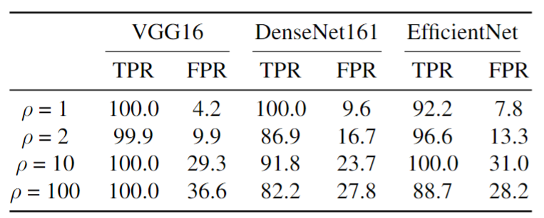

Table 7: Performance comparison of RPP against ISSBA backdoor attack with SoTA defense methods on 4 kinds of imbalanced CIFAR-10 datasets ($\mu=0.9$, $\rho$ = 2, 10, 100, 200).

Table 8: Performance of RPP against Badnets backdoor attack was evaluated on the balanced TinyImageNet training dataset $(\rho = 1)$ and the imbalanced TinyImageNet training datasets $(\rho = 2, 10, 100)$ under VGG16, DenseNet161, and EfficientNet model architectures with n = 100, $\alpha = 0.05$ and $\sigma = 1.0$.
